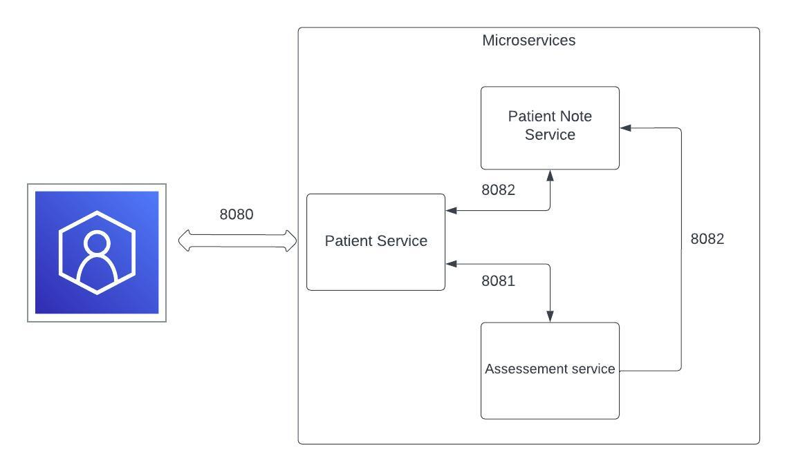

# **MEDISCREEN Application**

A comprehensive medical management system that encompasses three key microservices.

## **Table of Contents**
- [Features](#features)
- [Setup and Installation](#setup-and-installation)
- [Usage](#usage)
- [Technologies Used](#technologies-used)
- [Diagram of the application](#diagram-of-the-application)


## **Features**
- View a list of all patients.
- Add, update, or delete patient data.
- Add, update, or delete medical notes for a specific patient.
- Evaluates a patient's diabetes risk.

### **Services Overview**

#### **1. Patient Service (Port 8080):**
- Manages patient data with CRUD functionalities.
- Uses MySQL database for data persistence.
- Connects with the Notes and Assessment microservices.

#### **2. Notes Service (Port 8082):**
- Records and manages doctor's notes on patient consultations.
- Uses MongoDB for data storage.

#### **3. Assessment Service (Port 8081):**
- Evaluates a patient's diabetes risk.
- Interacts with the Patient and Notes services.

## **Setup and Installation**

### **Prerequisites**
- Java
- Maven
- Docker
- Suitable IDE (e.g., IntelliJ IDEA, Eclipse)

### **Steps**
1. **Clone the repository**:
```bash
git clone https://github.com/AnatolyRytik/mediscreen.git
```

2. **Build the project:**
```bash
mvn clean install
```
3. **Build Docker Files:**
```bash
docker-compose build
```

4. **Run Docker Containers:**
```bash
docker-compose up
```

### **Usage**
- View all patients: Navigate to http://localhost:8080/patients/all.
- You can add, delete, or modify patients.
- Manage patient notes: From a patient's page, click on "View notes" to view patient notes.
- You can add, delete, or modify notes.
- Get patient diabetes risk: From a patient's page, click on "Assessment details" to view patient diabetes risk.

### **Diagram of the application**



### **Technologies Used**
- Java
- Spring boot
- Thymeleaf
- Mysql
- MongoDB
- Maven
- Docker

